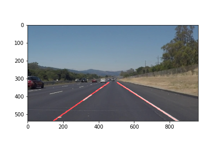

# **Finding Lane Lines on the Road** 
[](http://www.udacity.com/drive)


Overview
---

This repo contains the code written to complete the first project on Udacity Self-Driving Car Nanodegree. This project consists of algorithms to identify lane lines on the road on a video. The video is taken from a camera at the center of a vehicle.


Prerequisites
---
For this project, you need [Anaconda](https://anaconda.org/) installed


Installation
---
clone this repo using 
```
git clone https://github.com/dumebi/Udacity-CarND-LaneLines-P1.git
```
navigate to the folder and run the code using

```
jupyter notebook P1.ipynb
```

License
---
This project copyright is under [MIT](https://github.com/darienmt/CarND-LaneLines-P1/blob/master/LICENSE). License.


