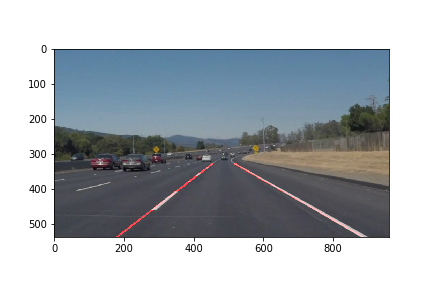

# **Finding Lane Lines on the Road** 

## Writeup Template

### You can use this file as a template for your writeup if you want to submit it as a markdown file. But feel free to use some other method and submit a pdf if you prefer.

---

**Finding Lane Lines on the Road**

The goals / steps of this project are the following:
* Make a pipeline that finds lane lines on the road
* Reflect on your work in a written report

[//]: # (Image References)

---

### Reflection

### 1. Describe your pipeline. As part of the description, explain how you modified the draw_lines() function.

My pipeline consisted of 6 steps. 
* I first converted each image to grayscale,
* Then i apploied a [Gaussian Blur](https://en.wikipedia.org/wiki/Gaussian_blur) 
* I applied [Canny Edge Detaction](https://en.wikipedia.org/wiki/Canny_edge_detector) which is used to detect edges in an image by marking where a color changes significantly to another; I've chosen a low_threshold of 50 and high_threshold of 150
* Next I limited the area in a polygon shape to where the lanes are, then applied [Hough Transform](https://en.wikipedia.org/wiki/Hough_transform) to get an array containing endpoints of detected line segments
* In order to draw a single line on the left and right lanes of each image, I modefied the drawlines function using what i studied from [This youtube post](https://www.youtube.com/watch?v=hnXkCiM2RSg&feature=youtu.be). 
  It was achieved by first getting the slope of each line. and adding the points to its corresponding points list
  Then all i needed to do was draw a line using certain bounds (like the horizon and bottom of the view) and draw a straight line joining the respective points
* Lastly put the drawn lines on top of the initial image

### 2. Identify potential shortcomings with your current pipeline

The images and videos this pipeline has been tested on are mainly straight roads with visible lane lines. 

One potential shortcoming would be what would happen when the visibility of the lane lines are reduced. ie when driving in the dark

Another shortcoming could be driving throuigh curved terrain

### 3. Suggest possible improvements to your pipeline

A  big possible improvement would be to keep tuning the canny edge and hough line parameters Hough lines parameters.

Another potential improvement could be to impprove my line to allow for curved lines
